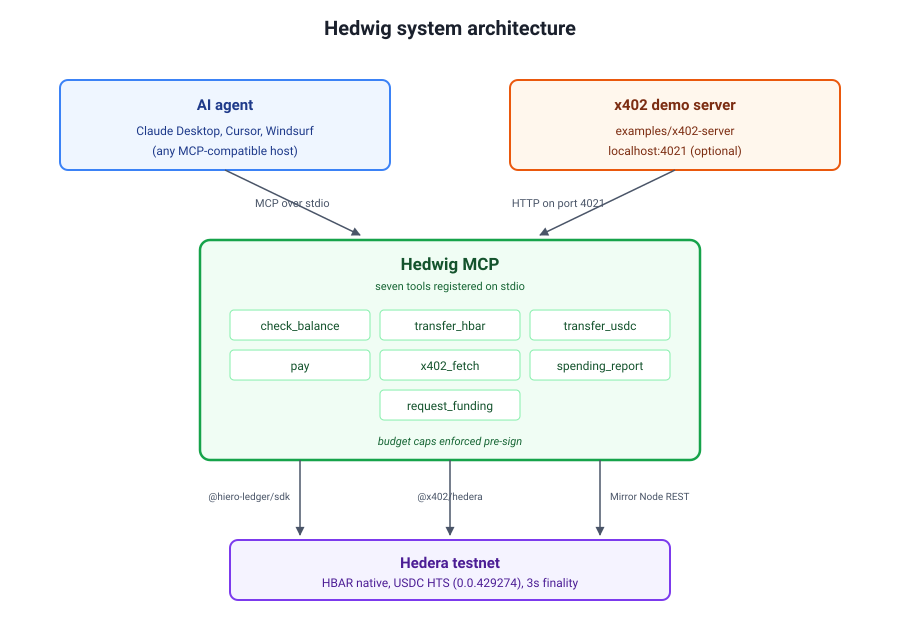
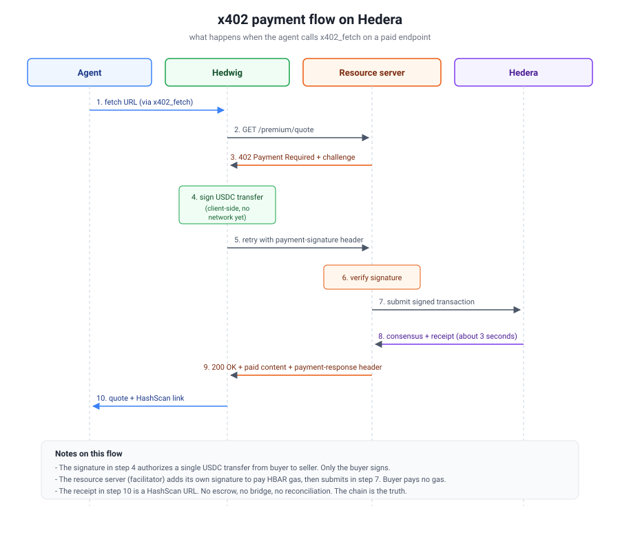

<p align="center">
  <a href="docs/hedwig_logo.png">
    
  </a>
</p>

<h1 align="center">Hedwig</h1>

<p align="center">
  <strong>An MCP wallet that gives AI agents autonomous HBAR and USDC payments on Hedera through the x402 protocol</strong>
</p>

<p align="center">
  Payments travel over HTTP using the x402 standard, which means agents can pay for API calls or gated content the same way a browser handles a login prompt. Every settlement is a real HTS transfer, done in about three seconds, for a fixed fee under a hundredth of a cent.
</p>

<p align="center">
  
  
  
  
  
  
</p>

---

## Features

- **Native HBAR + USDC** transfers on Hedera through Hedera Token Service, no bridges or wrapped assets. Charge either asset for x402 endpoints by toggling `X402_ASSET`.
- **x402 autopay** with the full protocol loop: detect 402, sign payment, retry with proof, deliver content. Buyer pays no gas because the resource server acts as fee payer.
- **Budget caps** enforced before every signature, both per-call and per-UTC-day, so a runaway agent cannot drain the account.
- **MCP native** with seven JSON-RPC tools exposed over stdio, works with Claude Desktop, Cursor, Windsurf, and any MCP host.
- **Reliable balance queries** via Hedera Mirror Node REST so cross-region traffic never times out on gRPC.
- **Full audit trail** through the spending report tool: session totals, budget usage, and a rolling history of the last 25 payments.
- **Local x402 demo server** included, so you can exercise the full flow on your own machine without any hosted dependency.
- **MetaMask-compatible ECDSA** keys, use a single private key across web3 wallets and Hedwig without conversion.

---

## Architecture

[](docs/architecture-system.svg)

[](docs/architecture-flow.svg)

---

## Tools

Seven tools exposed to the agent over MCP. Every tool that moves money runs through the budget checker before it signs.

| Tool                | What it does                                                                                                                     |
| ------------------- | -------------------------------------------------------------------------------------------------------------------------------- |
| `check_balance`     | Return HBAR and USDC balances plus a HashScan account link. Reads from Mirror Node REST for reliability.                         |
| `transfer_hbar`     | Send HBAR to any Hedera account. Real on-chain transfer, optional memo, HashScan link returned.                                  |
| `transfer_usdc`     | Send USDC (HTS token `0.0.429274` on testnet) to another USDC-associated account.                                                |
| `pay`               | Sign an x402 payment authorization without submitting anything. Useful when you want to drive the HTTP retry yourself.           |
| `x402_fetch`        | Full protocol loop: fetch a URL, catch the 402, sign the payment, retry with the signature header, return the paid body.         |
| `spending_report`   | Session totals, current budget usage, and a rolling history of the last 25 signed payments.                                      |
| `request_funding`   | Return your account ID plus a link to the Hedera Portal faucet, for topping up testnet HBAR.                                     |

---

## Quick start

Three lines and you have a wallet an agent can drive.

```
git clone https://github.com/DarshanKrishna-DK/Hedwig.git
cd Hedwig
run.bat        # Windows.  Or ./run.sh on macOS or Linux.
```

`run.bat` installs dependencies, compiles TypeScript, runs the unit test suite, submits a real on-chain smoke transaction (produces HashScan links), boots the MCP server on stdio, and opens the landing page site in a separate window. Leave both windows open. On first run it will pause and ask you to fill in `.env` with your Hedera testnet Account ID and ECDSA private key from [portal.hedera.com/dashboard](https://portal.hedera.com/dashboard).

For the paid endpoint your agent will hit, open another terminal:

```
start-x402-server.bat                   # Windows
node examples/x402-server/server.mjs    # cross-platform
```

By default the demo server charges 0.001 HBAR per request. To switch to USDC, add `X402_ASSET=usdc` to `.env` and restart the server.

### Wire Hedwig into Claude Desktop

Edit `%APPDATA%\Claude\claude_desktop_config.json` on Windows, or `~/Library/Application Support/Claude/claude_desktop_config.json` on macOS. Add this block and restart Claude Desktop fully from the system tray.

```
{
  "mcpServers": {
    "hedwig": {
      "command": "node",
      "args": ["C:/path/to/Hedwig/dist/index.js"],
      "env": {
        "HEDERA_ACCOUNT_ID": "0.0.YOUR_ID",
        "HEDERA_PRIVATE_KEY": "YOUR_ECDSA_KEY",
        "NETWORK": "hedera-testnet",
        "MAX_PER_CALL": "0.10",
        "MAX_PER_DAY": "20.00"
      }
    }
  }
}
```

Open a new chat and check the plug icon in the bottom-left. You should see `hedwig` with seven tools.

### Talk to your agent

```
> Check my Hedera balance.
> Send 0.05 HBAR to 0.0.9865777 with the memo "coffee tip".
> Send 0.001 USDC to 0.0.9865777.
> Fetch http://localhost:4021/premium/quote and pay if it costs HBAR.
> Fetch http://localhost:4021/premium/quote and pay if it costs USDC.
> Show me my spending report.
```

---

## Live testnet transactions

Every link below is a real transaction on Hedera testnet, submitted through Hedwig during a live demo run.

**Accounts.** Buyer: [0.0.6886052](https://hashscan.io/testnet/account/0.0.6886052). Auto-created x402 server: [0.0.9865777](https://hashscan.io/testnet/account/0.0.9865777).

| # | What | Asset | On-chain proof |
| - | ---- | ----- | -------------- |
| 1 | HBAR transfer (0.05 HBAR) | HBAR native | [0.0.6886052-1785556514-498454371](https://hashscan.io/testnet/transaction/0.0.6886052-1785556514-498454371) |
| 2 | USDC transfer (0.001 USDC) | HTS 0.0.429274 | [0.0.6886052-1785556535-966482234](https://hashscan.io/testnet/transaction/0.0.6886052-1785556535-966482234) |
| 3 | x402 payment (first run) | USDC | [0.0.9865777-1785556125-503661238](https://hashscan.io/testnet/transaction/0.0.9865777-1785556125-503661238) |
| 4 | x402 payment (repeat) | USDC | [0.0.9865777-1785556582-000507004](https://hashscan.io/testnet/transaction/0.0.9865777-1785556582-000507004) |

Rows 3 and 4 are the heart of the project. Agent hit 402, signed a payment on its own, retried with the payment signature header, and only got content after settlement reached consensus. No wallet popup, no manual approval, no bridge. Notice both transaction IDs start with the server account rather than the buyer, which proves gasless UX: the resource server pays HBAR gas as facilitator while the buyer only signs the transfer authorization.

---

## Repo layout

| Path                              | Role                                                                    |
| --------------------------------- | ----------------------------------------------------------------------- |
| `src/`                            | MCP server: seven tools, config, Hedera helpers, spending tracker       |
| `__tests__/`                      | Vitest unit tests for spending, config, and Hedera helpers              |
| `examples/x402-server/`           | Local x402 paid endpoint, auto-creates its own Hedera account           |
| `projects/Hedwig-frontend/`       | React site with landing page and docs (Vite + Tailwind + Framer Motion) |
| `docs/`                           | Architecture diagrams as SVG                                            |
| `scripts/smoke.mjs`               | End-to-end on-chain smoke test that produces HashScan links             |
| `DEMO.md`                         | Beat-by-beat script for the demo video recording                        |

---

## Scripts

| Command                                        | Purpose                                                                     |
| ---------------------------------------------- | --------------------------------------------------------------------------- |
| `run.bat` / `./run.sh`                         | **Full end-to-end.** Install, build, test, smoke, launch MCP + landing site.|
| `run-frontend.bat` / `./run-frontend.sh`       | Landing page + docs site only, on port 5173.                                |
| `start-x402-server.bat`                        | Boot the local paid endpoint on port 4021.                                  |
| `smoke.bat`                                    | Fast re-run of the on-chain smoke test only.                                |
| `npm run build`                                | Compile the MCP server TypeScript to `dist/`.                               |
| `npm test`                                     | Run the 10 unit tests.                                                      |
| `npm run smoke`                                | On-chain smoke test producing HashScan links.                               |
| `npm run build:mcpb`                           | Package as an .mcpb bundle for one-click Claude Desktop install.            |

**Network:** Hedera testnet. **HBAR asset id in x402:** `0.0.0`. **USDC HTS token id:** `0.0.429274` (testnet). **HashScan:** [https://hashscan.io/testnet](https://hashscan.io/testnet).