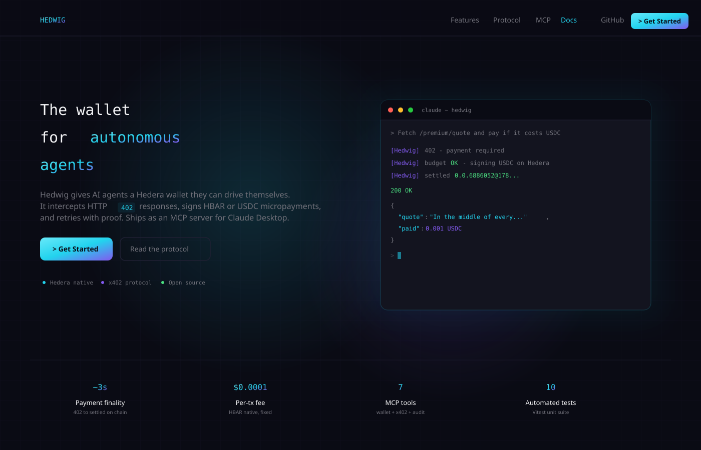

<p align="center">
  <a href="docs/hedwig_logo.png">
    
  </a>
</p>

# Hedwig

**An MCP wallet that gives AI agents autonomous HBAR and USDC payments on Hedera through the x402 protocol**

Payments travel over HTTP using the x402 standard, which means agents can pay for API calls or gated content the same way a browser handles a login prompt. Every settlement is a real HTS transfer, done in about three seconds, for a fixed fee under a hundredth of a cent.


[GitHub](https://github.com/DarshanKrishna-DK/Hedwig) &middot; [x402 docs](https://docs.x402.org) &middot; [Hedera x402 bounty](https://hedera.com/x402-bounty)

[](assets/Hedwig_HomeScreen.svg)

---

## Features

- **Native HBAR + USDC** transfers on Hedera through Hedera Token Service, no bridges or wrapped assets. Charge either asset for x402 endpoints by toggling `X402_ASSET`.
- **x402 autopay** with the full protocol loop: detect 402, sign payment, retry with proof, deliver content. Buyer pays no gas because the resource server acts as fee payer.
- **Budget caps** enforced before every signature, both per-call and per-UTC-day, so a runaway agent cannot drain the account.
- **MCP native** with seven JSON-RPC tools exposed over stdio, works with Claude Desktop, Cursor, Windsurf, and any MCP host.
- **Reliable balance queries** via Hedera Mirror Node REST so cross-region traffic never times out on gRPC.
- **Full audit trail** through the spending report tool: session totals, budget usage, and a rolling history of the last 25 payments.
- **Local x402 demo server** included, so you can exercise the full flow on your own machine without any hosted dependency.
- **MetaMask-compatible ECDSA** keys, use a single private key across web3 wallets and Hedwig without conversion.

---

## Architecture

[](docs/architecture-system.svg)

[](docs/architecture-flow.svg)

---

## Quick start

Three lines and you have a wallet an agent can drive.

```
git clone https://github.com/DarshanKrishna-DK/Hedwig.git
cd Hedwig
run.bat        # Windows.  Or ./run.sh on macOS or Linux.
```

**What `run.bat` does:** installs dependencies, compiles TypeScript, runs the unit test suite, submits a real on-chain smoke transaction (produces HashScan links), then boots the MCP server on stdio ready for Claude Desktop to attach. Leave the terminal open once it finishes. On first run it will pause and ask you to fill in `.env` with your Hedera testnet Account ID and ECDSA private key from [portal.hedera.com/dashboard](https://portal.hedera.com/dashboard).

**Run the demo x402 server (second terminal):** this is the paid endpoint your agent will hit.

```
start-x402-server.bat                   # Windows
node examples/x402-server/server.mjs    # cross-platform
```

By default the server charges 0.001 HBAR per request. To switch to USDC, add `X402_ASSET=usdc` to your `.env` and restart the server. Both flows produce real on-chain settlement.

**Browse the landing page and docs site (third terminal, optional):**

```
run-frontend.bat        # Windows
./run-frontend.sh       # macOS or Linux
```

Site opens at [http://localhost:5173](http://localhost:5173).

**Talk to your agent (Claude Desktop):** after wiring Hedwig into the MCP config and restarting, try any of these.

```
> Check my Hedera balance.
> Send 0.05 HBAR to 0.0.98 with the memo "coffee tip".
> Send 0.001 USDC to 0.0.9865777.
> Fetch http://localhost:4021/premium/quote and pay if it costs HBAR.
> Fetch http://localhost:4021/premium/quote and pay if it costs USDC.
> Show me my spending report.
```

---

## Snippets

**MCP config for Claude Desktop.** Windows path is `%APPDATA%\Claude\claude_desktop_config.json`. macOS path is `~/Library/Application Support/Claude/claude_desktop_config.json`. Restart Claude Desktop fully after saving.

```
{
  "mcpServers": {
    "hedwig": {
      "command": "node",
      "args": ["C:/path/to/Hedwig/dist/index.js"],
      "env": {
        "HEDERA_ACCOUNT_ID": "0.0.YOUR_ID",
        "HEDERA_PRIVATE_KEY": "YOUR_ECDSA_KEY",
        "NETWORK": "hedera-testnet",
        "MAX_PER_CALL": "0.10",
        "MAX_PER_DAY": "20.00"
      }
    }
  }
}
```

**Direct SDK use.** Import the tools individually if you're wiring Hedwig into your own server rather than through MCP.

```
import { registerX402Fetch } from "hedwig/tools/x402-fetch";
import { SpendingTracker } from "hedwig/spending";
import { loadConfig } from "hedwig/config";

const config = loadConfig();
const spending = new SpendingTracker(config.budget);
registerX402Fetch(server, config, spending);
```

**x402 server side.** Verify and settle payments in your own service using the ready-made facilitator. Works for both HBAR (`asset: "0.0.0"`) and USDC HTS (`asset: "0.0.429274"`).

```
import {
  toFacilitatorHederaSigner,
  createHederaSignAndSubmitTransaction,
  createHederaVerifyPayerSignature,
  createHederaPreflightTransfer
} from "@x402/hedera";
import { ExactHederaScheme } from "@x402/hedera/exact/facilitator";

const signer = toFacilitatorHederaSigner({
  getAddresses: () => [serverAccountId],
  signAndSubmitTransaction: createHederaSignAndSubmitTransaction(buildClient, serverKey),
  verifyPayerSignature: createHederaVerifyPayerSignature(),
  preflightTransfer: createHederaPreflightTransfer()
});
const facilitator = new ExactHederaScheme(signer);
```

---

## Live testnet transactions

Every link below is a real transaction on Hedera testnet, submitted through the Hedwig MCP wallet during a live demo run. Both HBAR and USDC flows work: the ones below are USDC because that's what the demo happened to capture, but HBAR runs produce identical structure with the asset field set to `0.0.0`.

**Accounts.** Buyer: [0.0.6886052](https://hashscan.io/testnet/account/0.0.6886052). Auto-created x402 server: [0.0.9865777](https://hashscan.io/testnet/account/0.0.9865777).

| # | What | Asset | On-chain proof |
| - | ---- | ----- | -------------- |
| 1 | HBAR transfer (0.05 HBAR) | HBAR native | [0.0.6886052-1785556514-498454371](https://hashscan.io/testnet/transaction/0.0.6886052-1785556514-498454371) |
| 2 | USDC transfer (0.001 USDC) | HTS 0.0.429274 | [0.0.6886052-1785556535-966482234](https://hashscan.io/testnet/transaction/0.0.6886052-1785556535-966482234) |
| 3 | x402 payment (first run) | USDC | [0.0.9865777-1785556125-503661238](https://hashscan.io/testnet/transaction/0.0.9865777-1785556125-503661238) |
| 4 | x402 payment (repeat) | USDC | [0.0.9865777-1785556582-000507004](https://hashscan.io/testnet/transaction/0.0.9865777-1785556582-000507004) |

Rows 3 and 4 are the heart of the project. Agent hit 402, signed a payment on its own, retried with the payment signature header, and only got content after settlement reached consensus. No wallet popup, no manual approval, no bridge. Notice both transaction IDs start with the server account rather than the buyer, which proves gasless UX: the resource server pays HBAR gas as facilitator while the buyer only signs the transfer authorization.

---

## Repo layout

| Path                              | Role                                                                    |
| --------------------------------- | ----------------------------------------------------------------------- |
| `src/`                            | MCP server: seven tools, config, Hedera helpers, spending tracker       |
| `__tests__/`                      | Vitest unit tests for spending, config, and Hedera helpers              |
| `examples/x402-server/`           | Local x402 paid endpoint, auto-creates its own Hedera account           |
| `projects/Hedwig-frontend/`       | React site with landing page and docs (Vite + Tailwind + Framer Motion) |
| `docs/`                           | Architecture diagrams as SVG                                            |
| `scripts/smoke.mjs`               | End-to-end on-chain smoke test that produces HashScan links             |
| `DEMO.md`                         | Beat-by-beat script for the demo video recording                        |

---

## Scripts

| Command                                        | Purpose                                                          |
| ---------------------------------------------- | ---------------------------------------------------------------- |
| `run.bat` / `./run.sh`                         | **Full end-to-end.** Install, build, test, smoke, launch MCP.    |
| `run-frontend.bat` / `./run-frontend.sh`       | **Landing page + docs site** on port 5173.                       |
| `start-x402-server.bat`                        | Boot the local paid endpoint on port 4021.                       |
| `smoke.bat`                                    | Fast re-run of the on-chain smoke test only.                     |
| `npm run build`                                | Compile the MCP server TypeScript to `dist/`.                    |
| `npm test`                                     | Run the 10 unit tests.                                           |
| `npm run smoke`                                | On-chain smoke test producing HashScan links.                    |
| `npm run build:mcpb`                           | Package as an .mcpb bundle for one-click Claude Desktop install. |

**Network:** Hedera testnet. **HBAR asset id in x402:** `0.0.0`. **USDC HTS token id:** `0.0.429274` (testnet). **HashScan:** [https://hashscan.io/testnet](https://hashscan.io/testnet).
